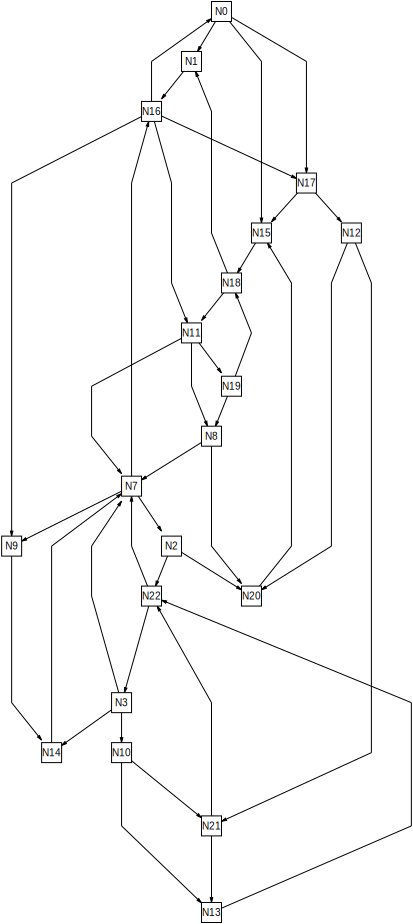

# ogdf-python 0.3.6-dev: Automagic Python Bindings for the Open Graph Drawing Framework

`ogdf-python` uses the [black magic](http://www.camillescott.org/2019/04/11/cmake-cppyy/)
of the awesome [cppyy](https://bitbucket.org/wlav/cppyy/src/master/) library to automagically generate python bindings
for the C++ [Open Graph Drawing Framework (OGDF)](https://ogdf.uos.de/).
It is available for Python\>=3.6 and is Apache2 licensed.
There are no binding definitions files, no stuff that needs extra compiling, it just works™, believe me.
Templates, namespaces, cross-language callbacks and inheritance, pythonic iterators and generators, it's all there.
If you want to learn more about the magic behind the curtains, read [this article](http://www.camillescott.org/2019/04/11/cmake-cppyy/).

## Useful Links

[Original repository](https://github.com/N-Coder/ogdf-python) (GitHub) -
[Bugtracker and issues](https://github.com/N-Coder/ogdf-python) (GitHub) -
[PyPi package](https://pypi.python.org/pypi/ogdf-python) (PyPi `ogdf-python`) -
[Try it out!](https://mybinder.org/v2/gh/N-Coder/ogdf-python/HEAD?labpath=docs%2Fexamples%2Fsugiyama-simple.ipynb) (mybinder.org).

[Official OGDF website](https://ogdf.uos.de/) (ogdf.net) -
[Public OGDF repository](https://github.com/ogdf/ogdf) (GitHub) -
[OGDF Documentation](https://ogdf.github.io/docs/ogdf/) (GitHub / Doxygen) -
[cppyy Documentation](https://cppyy.readthedocs.io) (Read The Docs).

## Quickstart

Click here to start an interactive online Jupyter Notebook with an example OGDF graph where you can try out `ogdf-python`: [](https://mybinder.org/v2/gh/N-Coder/ogdf-python/HEAD?labpath=docs%2Fexamples%2Fsugiyama-simple.ipynb)<br/>
Simply re-run the code cell to see the graph. You can also find further examples next to that Notebook (i.e. via the folder icon on the left).

To get a similar Jupyter Notebook with a little more compute power running on your local machine, use the following install command and open the link to `localhost`/`127.0.0.1` that will be printed in your browser:

``` bash
pip install 'ogdf-python[quickstart]'
jupyter lab
```

The optional `[quickstart]` pulls in matplotlib and jupyter lab as well as a ready-to-use binary build of the OGDF via [ogdf-wheel](https://github.com/ogdf/ogdf-wheel).
Please note that downloading and installing all dependencies (especially building `cppyy`) may take a moment.
If you want to use your own local build of the OGDF, see the instructions [below](#manual-installation) for installing `ogdf-python` without `ogdf-wheel`.

> [!IMPORTANT]  
> We currently support Linux, MacOS on Intel and Apple Silicon, and the Windows Subsytem for Linux.
> Directly running on **Windows is not supported**, see [issue 4](https://github.com/ogdf/ogdf-python/issues/8#issuecomment-2820925482).
> When using WSL, make sure that you are using the Linux python(3) and not the Windows python.exe, i.e. the [startup message](https://docs.python.org/3/tutorial/interpreter.html#interactive-mode) of the python interpreter should end with `on linux` instead of `on win32`.

## Usage

`ogdf-python` works very well with Jupyter:

``` python
# %matplotlib widget
# uncomment the above line if you want the interactive display

from ogdf_python import *
cppinclude("ogdf/basic/graph_generators/randomized.h")
cppinclude("ogdf/layered/SugiyamaLayout.h")

G = ogdf.Graph()
ogdf.setSeed(1)
ogdf.randomPlanarTriconnectedGraph(G, 20, 40)
GA = ogdf.GraphAttributes(G, ogdf.GraphAttributes.all)

for n in G.nodes:
    GA.label[n] = "N%s" % n.index()

SL = ogdf.SugiyamaLayout()
SL.call(GA)
GA
```

[](docs/examples/sugiyama-simple.ipynb)

Read the [pitfalls section](#pitfalls) and check out [docs/examples/pitfalls.ipynb](docs/examples/pitfalls.ipynb)
for the more advanced Sugiyama example from the OGDF docs.
There is also a bigger example in [docs/examples/ogdf-includes.ipynb](docs/examples/ogdf-includes.ipynb).
If anything is unclear, check out the python help `help(ogdf.Graph)` and read the corresponding OGDF documentation.

## Installation without ogdf-wheel

Use pip to install the `ogdf-python` package locally on your machine.
Please note that building `cppyy` from sources may take a while.
Furthermore, you will need a local shared library build (`-DBUILD_SHARED_LIBS=ON`) of the [OGDF](https://ogdf.github.io/doc/ogdf/md_doc_build.html).
If you didn't install the OGDF globally on your system,
either set the `OGDF_INSTALL_DIR` to the prefix you configured in `cmake`,
or set `OGDF_BUILD_DIR` to the subdirectory of your copy of the OGDF repo where your
[out-of-source build](https://ogdf.github.io/doc/ogdf/md_doc_build.html#autotoc_md4) (and especially the generated `OgdfTargets.cmake` file) lives.

``` bash
$ pip install ogdf-python
$ OGDF_BUILD_DIR=~/ogdf/build-release python3
```

### Debug and Release Mode

Starting with OGDF 2025.10 (Foxglove), your chosen build mode (debug or release) also affects
the name of the built shared libraries (e.g. `libOGDF-debug.so` instead of `libOGDF.so`) as well as
the location of the header file containing configuration information (`ogdf-{debug,release}/ogdf/basic/internal/config_autogen.h`).
By default, ogdf-python will attempt to load the release versions, even if you only have the debug version built/installed.
To load the debug versions instead, set the environment variable `OGDF_PYTHON_MODE=debug`.

``` bash
$ OGDF_BUILD_DIR=~/ogdf/build-debug OGDF_PYTHON_MODE=debug python3
$ OGDF_PYTHON_MODE=debug python3 # also works if you have both versions installed next to each other
```

## Pitfalls

See also [docs/examples/pitfalls.ipynb](docs/examples/pitfalls.ipynb) for full examples.

OGDF sometimes takes ownership of objects (usually when they are passed as modules),
which may conflict with the automatic cppyy garbage collection.
Set `__python_owns__ = False` on those objects to tell cppyy that those objects
don't need to be garbage collected, but will be cleaned up from the C++ side.

``` python
SL = ogdf.SugiyamaLayout()
ohl = ogdf.OptimalHierarchyLayout()
ohl.__python_owns__ = False
SL.setLayout(ohl)
```

When you overwrite a python variable pointing to a C++ object (and it is the only
python variable pointing to that object), the C++ object will usually be immediately deleted.
This might be a problem if another C++ objects depends on that old object, e.g.
a `GraphAttributes` instance depending on a `Graph` instance.
Now the other C++ object has a pointer to a deleted and now invalid location,
which will usually cause issues down the road (e.g. when the dependant object is
deleted and wants to deregister from its no longer alive parent).
This overwriting might easily happen if you run a Jupyter cell multiple times or some code in a `for`-loop.
Please ensure that you always overwrite or delete dependent C++ variables in
the reverse order of their initialization.

``` python
for i in range(5):
    # clean-up all variables
    CGA = CG = G = None # note that order is different from C++, CGA will be deleted first, G last
    # now we can re-use them
    G = ogdf.Graph()
    CG = ogdf.ClusterGraph(G)
    CGA = ogdf.ClusterGraphAttributes(CG, ogdf.ClusterGraphAttributes.all)

    # alternatively manually clean up in the right order
    del CGA
    del CG
    del G
```

There seems to be memory leak in the Jupyter Lab server which causes it to use large amounts of memory
over time while working with ogdf-python. On Linux, the following command can be used to limit this memory usage:

``` bash
systemd-run --scope -p MemoryMax=5G --user -- jupyter notebook
```
